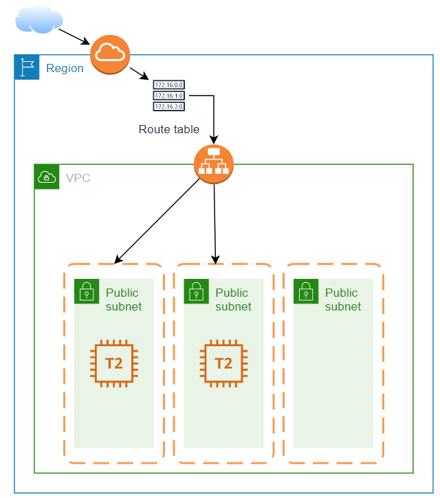

Terraform script that creates Ubuntu instances in AWS and configures it using provisioners. To configure multiple instances, change the count value in the variable file.

The script deploys Apache2 web server which are load balanced.

I have split the code in different files for easier readability.

The script creates a subnet in each availability zone and then splits the instances across different subnets. It will create a subnet in each AZ regardless of the instance count. Please edit the code for subnet section if you wish to deploy a single subnet.

To run this script, the following requirements must be met:
1. AWS CLI installed and authenticated using an account with correct privileges
2. This script was tested using the following version:
    Terraform v0.12.25
    Provider.aws v2.63.0

To summarize, the script will deploy the following:

